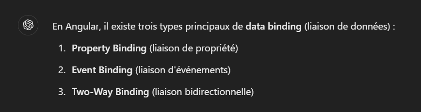
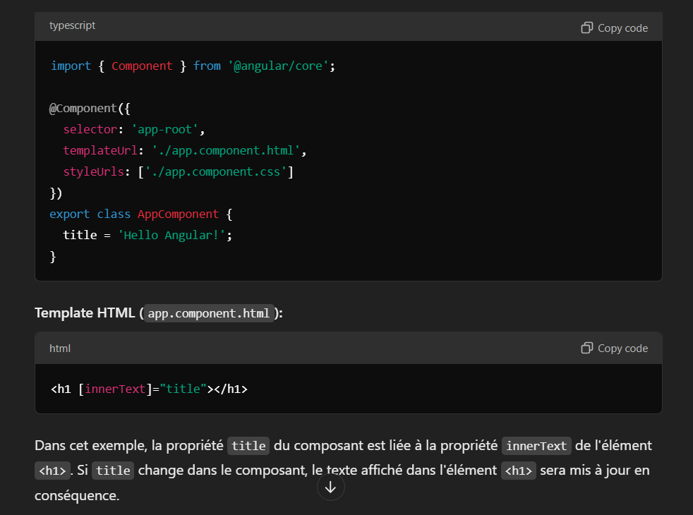
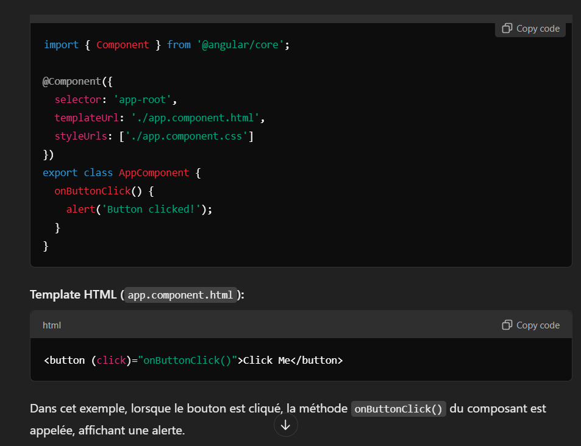
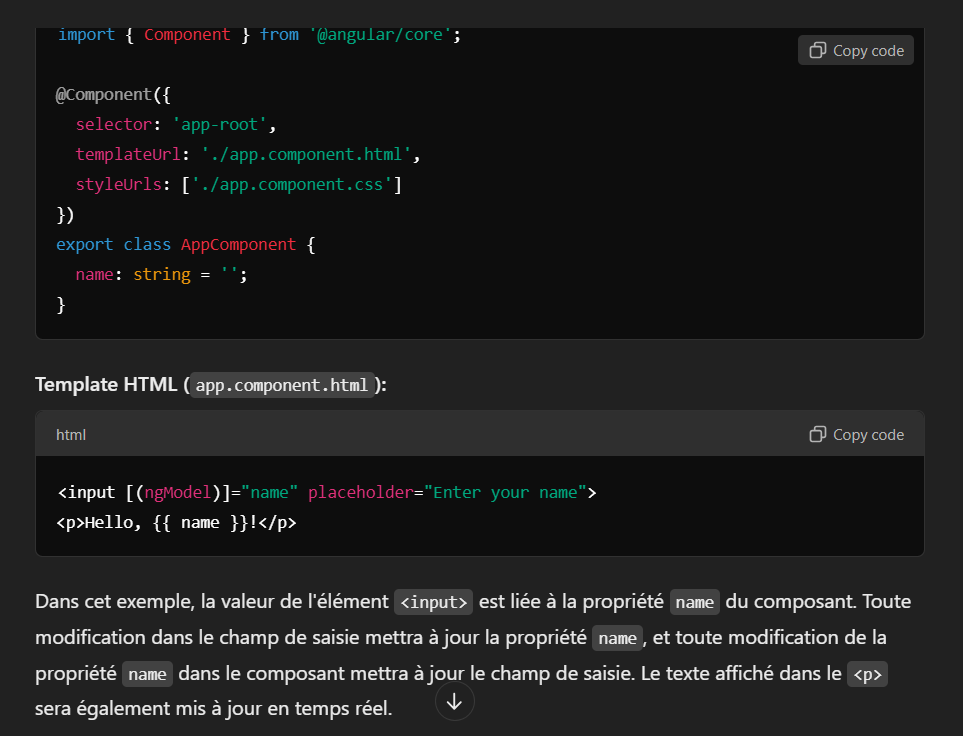

# Bookshop (angular version 17.3.9.)

- generate angular project: `ng new your-project-name --no-standalone`
- create component        : `ng g c component-name`
- add bootstrap           : `ng add @ng-bootstrap/ng-bootstrap`
- run server              : `ng serve`

Dans agular, il y a deux concept à comprendre:
- les 3 types de liaisons des données (Data Binding)
- La communication entre les composants

## Les 03 types de Data Binding

## La communication entre les composants

1. Parent to Child Communication
La communication du parent vers l'enfant se fait en passant des données du composant parent au composant enfant via des propriétés d'entrée (input properties).

