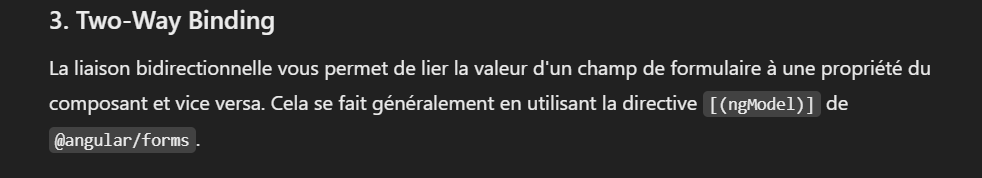

# Bookshop (angular version 17.3.9.)

- generate angular project: `ng new your-project-name --no-standalone`
- create component        : `ng g c component-name`
- add bootstrap           : `ng add @ng-bootstrap/ng-bootstrap`
- run server              : `ng serve`

Dans ce projet nous avons vu les principaux concepts d'angular à connaitre:
- les 3 types de liaisons des données (Data Binding)
- La communication entre les composants
- les services
- le routing
- les models
- RXjs et httpclient
- les formulaires
- les modules

## Les 03 types de Data Binding

* depuis la classe de composant vers le DOM (property binding)

* depuis le DOM vers la classe de composant grace à Event Handler

* binding dans les deux sens

## La communication entre les composants

1. Parent to Child Communication
La communication du parent vers l'enfant se fait en passant des données du composant parent au composant enfant via des propriétés d'entrée (input properties).

## RXJS

RxJS (Reactive Extensions for JavaScript) dans Angular est une bibliothèque qui permet de travailler avec des flux de données de manière réactive, c'est-à-dire en réagissant à des événements au fur et à mesure qu'ils se produisent.

* Exemple simple
Imagine un robinet qui goutte de l'eau. Chaque goutte d'eau est un événement, et toi, avec un verre, tu peux attraper chaque goutte quand elle tombe. Dans RxJS, le robinet est ce qu'on appelle un Observable, et le verre que tu utilises pour attraper l'eau est ce qu'on appelle un Observer.

Voici comment ça marche :

* Concepts de base
1. Observable : Un flux de données ou d'événements (comme une suite de gouttes d'eau) qui peut émettre des valeurs au fil du temps. Ces valeurs peuvent être :

* * Des événements (clics de souris, frappes de clavier, etc.)
* * Des réponses HTTP
* * Des changements dans les données
* * Observer : C'est toi, l'observateur. Tu t'abonnes à un Observable pour réagir à ce qu'il émet.

2. Subscription : Lorsque tu t'abonnes à un Observable, tu commences à recevoir les données qu'il émet. Tu peux te désabonner pour arrêter de recevoir les événements.

3. Operators : RxJS offre de nombreux "opérateurs" pour transformer, filtrer ou combiner des flux de données. Par exemple, si tu ne veux attraper que les gouttes d'eau à intervalle de 2 secondes, tu peux utiliser un opérateur pour filtrer les événements.

Voici un récapitulatif de la façon dont les services, Observables et souscriptions fonctionnent dans Angular :

1. Le Service

* Le service est responsable de la communication avec le backend (API).
* Il contient des méthodes pour récupérer ou envoyer des données.
* Ces méthodes retournent généralement un Observable, qui est un flux de données asynchrone.

2. Observable

* Un Observable est un flux de données asynchrone. Il attend des données (comme une requête HTTP) et les fournit lorsque celles-ci sont disponibles.
* Les données ne sont pas reçues immédiatement, il faut "s'abonner" à l'Observable pour recevoir les données quand elles arrivent.

3. Souscription dans le Composant

* Le composant est l'endroit où l'on consomme les données. Pour obtenir les données d'un service, on s'abonne à l'Observable retourné par ce service.
* La méthode subscribe() est utilisée pour recevoir les données et exécuter des actions une fois les données reçues.
* Gestion des erreurs : La souscription permet aussi de capturer les erreurs liées à la requête.

## Le Pipe async

Le pipe async dans Angular est un outil puissant qui permet de gérer plus facilement les Observables (ou les Promises) directement dans les templates, sans avoir besoin d'appeler manuellement subscribe() ou de gérer le désabonnement.

1. Fonctionnement du Pipe async
Le pipe async :

* S'abonne automatiquement à l'Observable ou à la Promise.
* Retourne la valeur de l'Observable/Promise une fois qu'elle est disponible.
* Se désabonne automatiquement lorsque le composant est détruit, ce qui empêche les fuites de mémoire.

2. Utilisation du Pipe async avec un Observable
Au lieu de souscrire manuellement à un Observable dans le composant et de stocker sa valeur dans une variable, on peut utiliser le pipe async directement dans le template. Cela simplifie le code et évite d'écrire du code supplémentaire pour gérer les abonnements.

